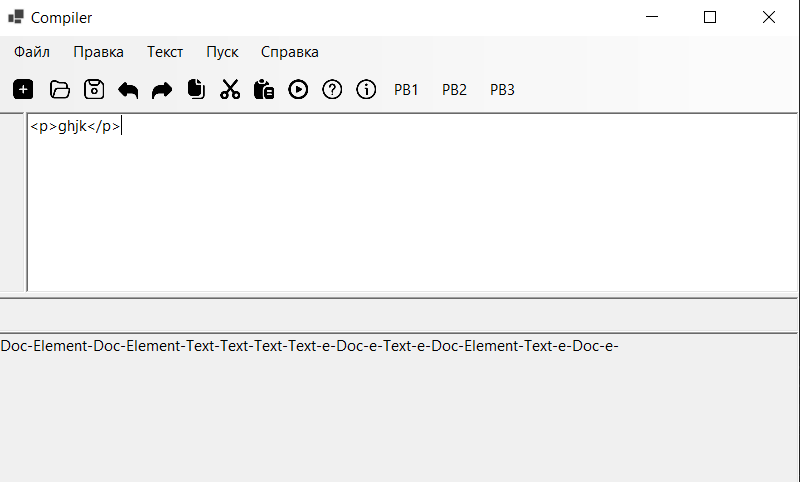
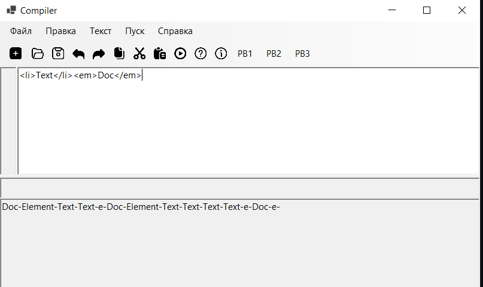

# Лабораторная работа 7
## Описание

Цель работы: Разработать для грамматики алгоритм синтаксического анализа на основе метода рекурсивного спуска.

## Грамматика
G[Doc]:
1. Doc -> λ | Element Doc
2. Element -> Text | \<em> Doc \</em> | \
 Doc \
 | \<ol> List \</ol>
3. List -> λ | ListItem List
4. ListItem -> \<li> Text \</li>
5. Text -> λ | Char Text
Char -> a | b | c | … | z | A | B | … | Z
Примечание: данными продукциями описывается язык
HTML-разметки.

## Язык грамматики
Примеры слов, принадлежащих языку L(G[Doc]):
1) \
ghjk\

2) \<li>Text\</li>\<em>Doc\</em>
3) dfgh

## Классификация грамматики

Грамматика G[<Выражение>] является контекстно-свободной
Контекстно-свободные грамматики имеют правила
следующего вида: A → a, где A∈VN, a∈V*.
Здесь в левой части правил может быть только один нетерминальный
символ, а в правой – любая последовательность из терминалов и
нетерминалов.
Все правила имеют одну и ту же форму: нетерминал → строка терминалов и/или нетерминалов. Это делает грамматику контекстно-свободной.

## Тестовые примеры

