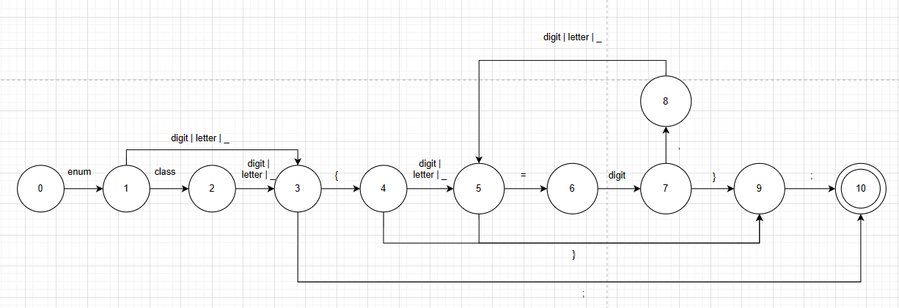
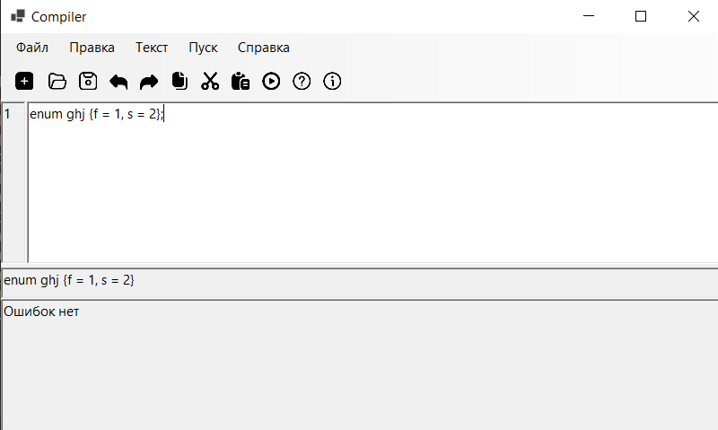
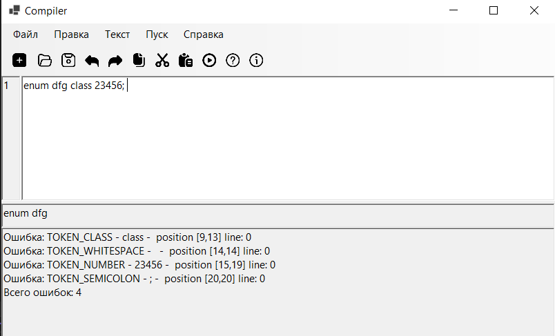

# Объявление перечисляемого типа на языке C++
## Примеры допустимых строк
```
enum samyil {first = 1, second, third};
enum ff445dd {el1=1, el2=2, el3=3};
```
## Разработанная грамматика
```
<DEF> -> 'enum' <ENUM>
<ENUM> -> (digit|letter|_) <ENUM_ID>
<ENUM> -> 'class'  <CLASS>
<CLASS> -> (digit|letter|_) <ENUM_ID>
<ENUM_ID> -> '{' <OPEN_BRACE>
<ENUM_ID> -> ';' <SEMICOLON>
<OPEN_BRACE> -> (digit|letter|_) <ID>
<OPEN_BRACE> -> '}' <CLOSE_BRACE>
<ID> -> '}' <CLOSE_BRACE>
<ID> -> '=' <EQUAL>
<EQUAL> -> digit <NUMBER>
<ID> -> ',' <COMMA>
<COMMA> -> (digit|letter|_) <ID>
<NUMBER> -> '}' <CLOSE_BRACE>
<NUMBER> -> ',' <COMMA> 
<CLOSE_BRACE> -> ';' <SEMICOLON>
<SEMICOLON> -> <END>
```
## Граф конечного автомата

## Тестовые примеры


